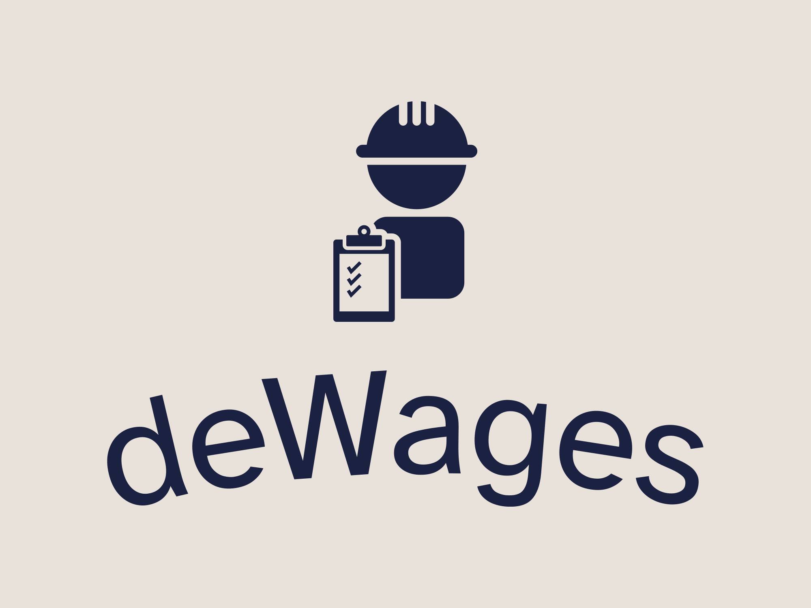

<h1 align="center">
  
   
  deWages
</h1>

   <strong>deWages</strong> - Tagline 
  DU Hacks 3.0 || Team L(ETH)AL.

**Theme:** Web3, Open Innovation.

**deWages** is a Decentralised Application (dApp) which addresses the  <b>exploitation of blue collar workers</b> by facilitating job enrollments and automatic payments, ensuring both --> The Employer and the Employee benefit from the Transparency.

### Features
deWork offers the following features:
- **Seamless Job Management**
  Streamlined job posting, application, and hiring processes, enabling companies to effortlessly post daily job listings while allowing blue-collar workers to apply for suitable jobs. Fair Proximity-Based Workforce Allocaton.
- **Automated Payments**
  Ensures timely and transparent transactions between companies and workers. By automatically transferring payments to workers' wallets based on hours worked, the system mitigates the risk of delayed or withheld wages, thereby safeguarding workers' financial interests and reducing the potential for exploitation.
- **Incentive System**
  Rewards blue-collar workers with NFTs based on their working hours. These NFTs can be redeemed for social security benefits.

### Working
The DApp involves two primary stakeholders: blue-collar workers and companies.

1. **Job Posting and Application**
    The DApp facilitates daily job postings by companies, specifying job details and locations. Blue-collar workers, along with companies, connect their wallets to the portal. Companies post jobs with location and hourly salary. Workers browse available job listings and apply for jobs.

2. **Hiring Process**
   Workers are hired based on proximity to the job location and the number of vacancies available in First Come First Serve (FCFS) fashion. 

3. **Staking and Attendance Management**
    Before hiring workers, companies stake an amount in Ether to demonstrate their commitment. Hired workers use a QR code-based check-in and check-out system to mark attendance, providing accurate tracking of work hours.

4. **Automated Payment Processing**
   Upon check-out, payments are automatically transferred from the company's wallet to the worker's wallet based on the number of hours worked. 

5. **Reward System with NFTs**
   Workers are incentivized through a reward system where they earn non-fungible tokens (NFTs) based on the number of hours worked which can redeemed to leverage social security.

## Resources
- [Demo Video]()
- [GitHub Repository](https://github.com/ShauryaSwarup/L-ETH-AL)
- [Deployed Contract on Polygon]()
- [Devfolio Submission]()

## 🤖Tech-Stack

#### Web
- NextJS
- Tailwind CSS
- Wagmi
- Viem
- RainbowKit

#### Blockchain
- Solidity
- Hardhat
- Polygon

## 🔮Future Scope and Business Potential
- 
- 
- 

## 👨‍💻Team Members
- [Shaurya Swarup](https://github.com/ShauryaSwarup)
- [Narayani Bokde](https://github.com/narayanibokde9)
- [Aditya Kulkarni](https://github.com/justaskulkarni)
